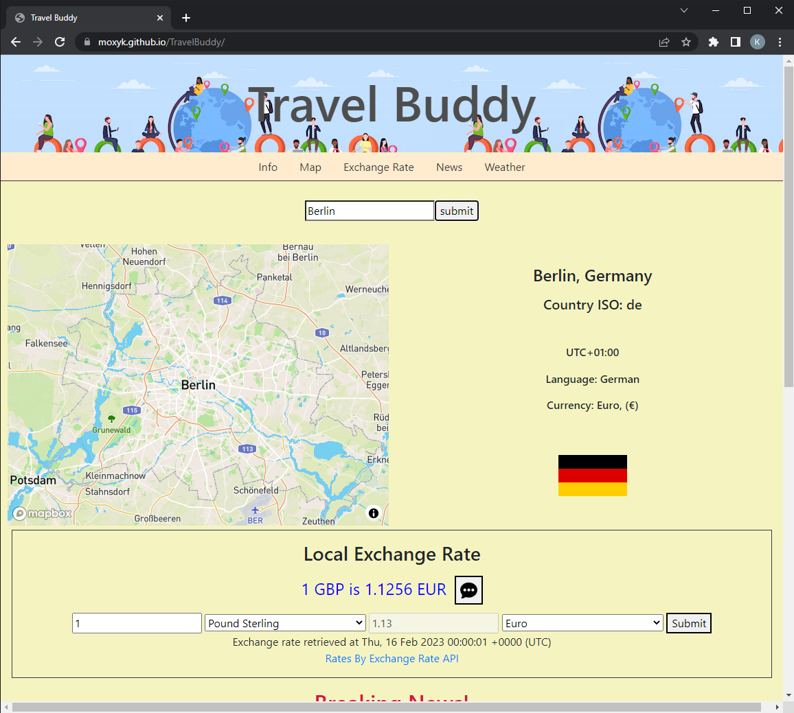
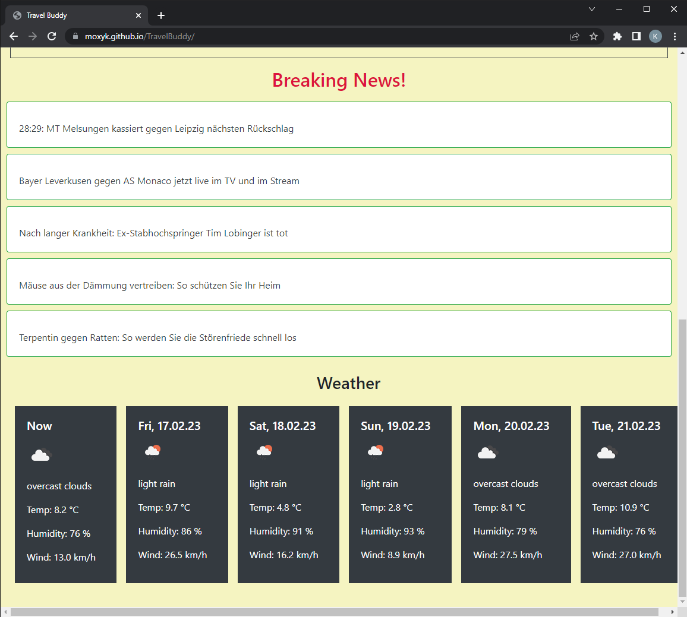

# Travel Buddy

The Travel App for the versed Traveller

## Description

This App presents the user with an input to search for their next travel destination.  Helpful information like language, time zone or currency will be display and the destinaton will be highlighted on the map. Furthermore, the traveller will get the current exchange rate for the country's currency and they can calculate how much money they would get when they exchange a certain amount. As it is always good to be well informed about your travel destination, the current news will be displayed for the country.  And lastly, as one needs to know what to pack, the traveller will get the current weather and a 5-day weather forcast. Bon voyage!

### Repository

https://github.com/MoxyK/TravelBuddy/

### Deployed Page

https://moxyk.github.io/TravelBuddy/

## Installation

This app will run in the browser, and will feature dynamically updated HTML and CSS powered by JavaScript code.

## Usage

The User will be able to search for a city, country or place of interest and will be presented with helpful information, seeing the search on the map, get currency exchange rate, news, weather and a 5-day weather forecast.  The user can calculate how much money he would get in the local currency and they can follow the news links. Currency exchange rate will be read by a speech sythesiser while pressing the button next to the exchange rate.

This is how the deployed pages looks like:

Screenshots of deployed Webpage

## Future Improvements

Future Improvements will include displaying more useful information like country emergency numbers and dialing codes.  The exchange rate feature will include reverse calculation from the foreign currency back into home currency.  One of the major feature will be accesibility and make further parts of the page being read out aloud by the speech synthesiser.

## Credits

N/A

## License

This project uses the MIT License. Please see the license file in the repositiry for fursther details.